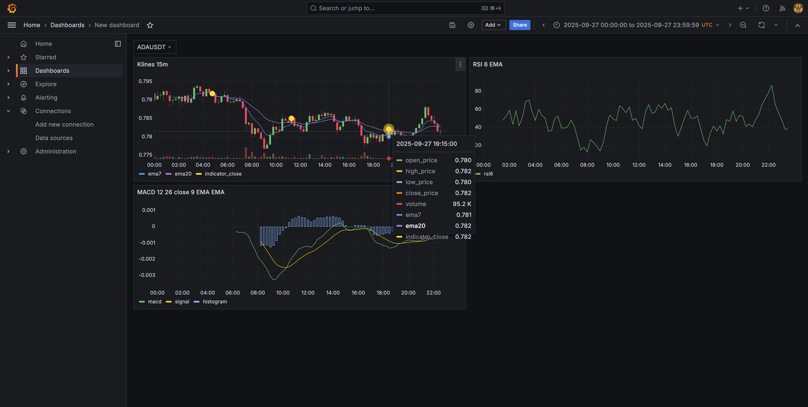

# Crypto Cloud

Crypto Cloud is a data platform for collecting, transforming, and serving crypto market data with both local Docker workflows and AWS deployment via Terraform.

## Grafana dashboards

Sample dashboard screenshot:


## What is in the codebase

- Data lifecycle modules under `apps/crypto_data`:
  - `generation`: market event generation (for example aggtrades producer flow).
  - `ingestion`: raw data ingestion jobs.
  - `transformation`: Spark/Flink transformations (`klines`, `macd`, `rsi`, `pattern_one/two/three`, `crypto_stream`).
  - `serving`: serving consumers/sinks.
  - `orchestration`: Airflow DAGs and runtime container.
- Shared utilities in `apps/shared_lib` (Kafka/Kinesis/S3/MinIO/Spark/Flink helpers).
- Local environments in `infras/docker`:
  - Batch storage: MinIO, Postgres, Hive Metastore.
  - Stream storage: ClickHouse, Kafka, Kafka UI.
  - Batch processing: Spark + Airflow.
  - Stream processing: Flink JobManager + TaskManager.
- AWS infra modules in `infras/terraform` (VPC, Kinesis, Glue, ECS, Lambda, ClickHouse, Grafana, and more).

## High-level flow

1. Producer entrypoints publish aggtrades events to stream (`Kafka` locally, `Kinesis` in cloud).
2. Flink stream job (`entrypoints/flink_jobs/crypto_stream`) computes klines and indicators.
3. Stream outputs are written to ClickHouse and indicator streams.
4. Spark/Glue jobs process batch datasets and write Iceberg-backed tables.
5. Serving and dashboards consume curated outputs.

## Repository layout

- `apps/crypto_data`: domain code by lifecycle stage.
- `apps/shared_lib`: reusable Python library.
- `infras/docker`: local Docker compose stacks and service images.
- `infras/terraform`: root Terraform config + modules.
- `scripts`: operational helper scripts.
- `build`: generated artifacts (for example Spark/Glue libs).

## Local setup

Create Docker network (once):

```bash
make docker-network-create
```

Start local stacks:

```bash
make docker-batch-storage-up
make docker-stream-storage-up
make docker-batch-processing-up
make docker-minio-create-bucket
make docker-clickhouse-init
make docker-stream-processing-up
```

Stop local stacks:

```bash
make docker-stream-processing-down
make docker-batch-processing-down
make docker-stream-storage-down
make docker-batch-storage-down
```

Useful local endpoints:

- MinIO API: `http://localhost:9000`
- MinIO Console: `http://localhost:9001`
- Kafka UI: `http://localhost:8090`
- Spark Master UI: `http://localhost:8080`
- Airflow UI: `http://localhost:8082`
- Flink UI: `http://localhost:8091`
- ClickHouse HTTP: `http://localhost:8123`

## Running jobs

Spark job entrypoints are in `apps/crypto_data/entrypoints/spark_jobs` (`aggtrades.py`, `klines.py`, `macd.py`, `rsi.py`, `pattern_one.py`, `pattern_two.py`, `pattern_three.py`).

Example:

```bash
make spark-submit \
  job=pattern_two \
  symbol=ADAUSDT \
  landing_date=2025-09-27 \
  data_lake_bucket=$DATA_LAKE_BUCKET \
  transform_db=$TRANSFORM_DB \
  iceberg_lock_table=$ICEBERG_LOCK_TABLE
```

Build packaged libs for Spark/Glue jobs:

```bash
make build-artifacts stage=transformation job=pattern_two dir=spark_jobs
```

## Infrastructure (Terraform)

Terraform root: `infras/terraform`.

```bash
make terraform-init
make terraform-plan
make terraform-apply
```

Common extras:

- `make terraform-destroy`
- `make terraform-output`
- `make glue-scripts-sync`

## Notes

- Configure `.env` before running local stacks.
- App-specific examples are in `apps/crypto_data/**/README.md`.
