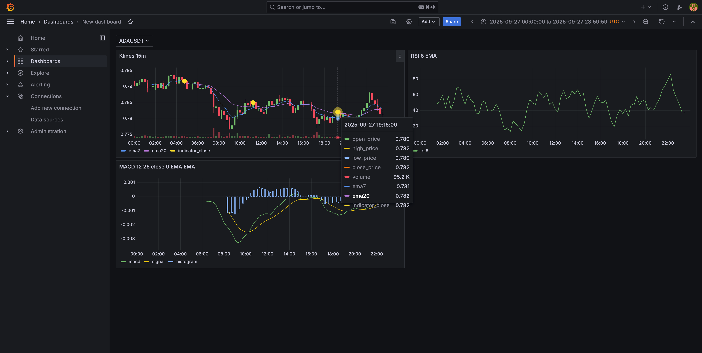

# Crypto Cloud

Crypto Cloud is a data platform for collecting, transforming, and serving crypto market data with both local Docker workflows and AWS deployment via Terraform.

## Grafana dashboards

Sample dashboard screenshot:


## High-level flow

### Stream flow (real-time)

- Binance aggtrades replay -> `aggtrades-stream` (`Kafka` local / `Kinesis` cloud)
- `aggtrades-stream` -> Flink stream job (event-time + watermark)
- Flink -> 15-minute `klines` (OHLCV)
- `klines` -> indicators (EMA, RSI, MACD, trend, candlestick pattern)
- Flink outputs -> ClickHouse `klines` + ClickHouse indicators + pattern indicator stream (`Kafka`/`Kinesis`)
- Real-time Dashboards/consumers -> read from ClickHouse and indicator stream

### Batch flow (daily ETL)

- Binance daily aggtrades zip -> ingestion job
- Ingestion job -> object storage `raw_zone` (CSV) -> `landing_zone` (parquet)
- Landing parquet -> Spark/Glue transform -> Iceberg `aggtrades`
- Iceberg `aggtrades` -> Spark/Glue kline aggregation -> Iceberg `klines`
- Iceberg `klines` -> indicator/pattern transforms (`macd`, `rsi`, `pattern_one/two/three`)
- Airflow orchestrates job chain (`aggtrades` -> `klines` -> `macd`, `rsi` -> `pattern_one/two/three`)
- Analytics/serving -> consume Iceberg tables (Athena/Glue/Spark locally or on AWS)

## What is in the codebase

- Data lifecycle modules under `apps/crypto_data`:
  - `entrypoints`: runtime entrypoints for Spark/Flink jobs and workers.
  - `generation`: market event generation (for example aggtrades producer flow).
  - `ingestion`: raw data ingestion jobs.
  - `transformation`: Spark/Flink transformations (`klines`, `macd`, `rsi`, `pattern_one/two/three`, `crypto_stream`).
  - `serving`: serving consumers/sinks.
  - `orchestration`: Airflow DAGs and runtime container.
- Shared utilities in `apps/shared_lib` (Kafka/Kinesis/S3/MinIO/Spark/Flink helpers).
- Local environments in `infras/docker`:
  - Batch storage: MinIO, Postgres, Hive Metastore.
  - Stream storage: ClickHouse, Kafka, Kafka UI.
  - Batch processing: Spark + Airflow.
  - Stream processing: Flink JobManager + TaskManager.
- AWS infra modules in `infras/terraform` (VPC, Data Lake, Glue, Airflow, Kinesis, Flink, ClickHouse, Grafana, and more).

## Repository layout

- `apps/crypto_data`: domain code by lifecycle stage.
- `apps/shared_lib`: reusable Python library.
- `infras/docker`: local Docker compose stacks and service images.
- `infras/terraform`: root Terraform config + modules.
- `scripts`: operational helper scripts.
- `build`: generated artifacts (for example Spark/Glue libs).

## Local setup

Load project env and runtime shell:

```bash
source scripts/setup.sh
source scripts/spark.sh   # Spark/Glue runtime
source scripts/flink.sh   # Flink runtime
```

Create Docker network (once):

```bash
make docker-network-create
```

Start local stacks:

```bash
make docker-batch-storage-up
make docker-stream-storage-up
make docker-batch-processing-up
make docker-minio-create-bucket
make docker-clickhouse-init
make docker-stream-processing-up
```

Stop local stacks:

```bash
make docker-stream-processing-down
make docker-batch-processing-down
make docker-stream-storage-down
make docker-batch-storage-down
```

Useful local endpoints:

- MinIO API: `http://localhost:9000`
- MinIO Console: `http://localhost:9001`
- Kafka UI: `http://localhost:8090`
- Spark Master UI: `http://localhost:8080`
- Airflow UI: `http://localhost:8082`
- Flink UI: `http://localhost:8091`
- ClickHouse HTTP: `http://localhost:8123`

## Running jobs

Spark job entrypoints are in `apps/crypto_data/entrypoints/spark_jobs` (`aggtrades.py`, `klines.py`, `macd.py`, `rsi.py`, `pattern_one.py`, `pattern_two.py`, `pattern_three.py`).

Example:

```bash
make spark-submit \
  job=pattern_two \
  symbol=ADAUSDT \
  landing_date=2025-09-27 \
  data_lake_bucket=$DATA_LAKE_BUCKET \
  transform_db=$TRANSFORM_DB \
  iceberg_lock_table=$ICEBERG_LOCK_TABLE
```

Build packaged libs for Glue/Flink jobs:

```bash
make build-artifacts stage=transformation job=macd dir=spark_jobs
```

Glue/Flink build and upload:

```bash
make flink-scripts-build stage=transformation job=crypto_stream
make flink-scripts-upload job=crypto_stream
```

## Infrastructure (Terraform)

Terraform root: `infras/terraform`.

```bash
make terraform-init
make terraform-plan
make terraform-apply
```

Common extras:

- `make terraform-destroy`
- `make terraform-output`

Load Terraform outputs as shell env vars:

```bash
source scripts/terraform_output.sh
```

Includes account/networking/data-lake/glue/ECR/Athena values from `infras/terraform/outputs.tf`.

## Notes

- Configure `.env` before running local stacks.
- App-specific examples are in `apps/crypto_data/**/README.md`.
